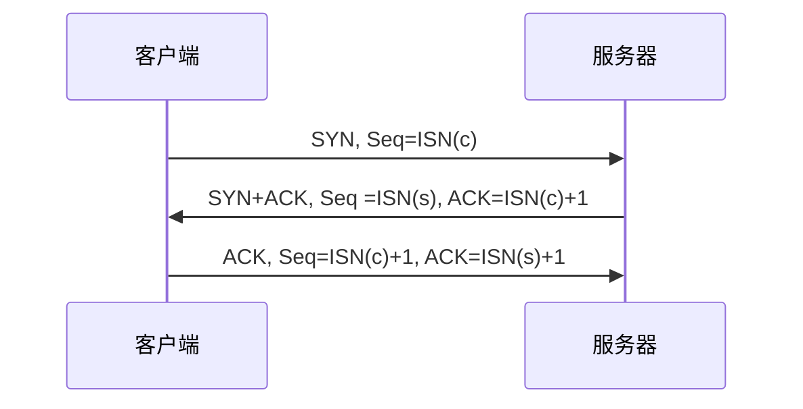
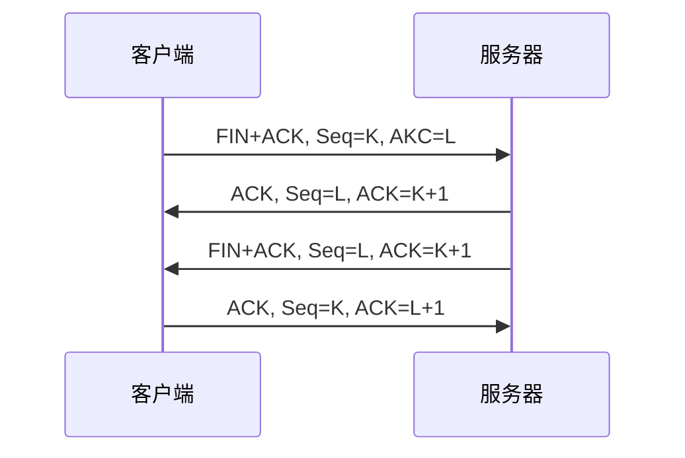

# TCP/IP 详解

> ==TCP提供了一种面向连接的、可靠的字符流服务==
面向连接：是指TCP的两个应用程序必须在他们交换数据之前，通过相互联系建立一个TCP连接。

### TCP的可靠性
TCP提供一个字符流接口，TCP必须把一个发送应用程序的字节流转成一组IP可以携带的分组，被称为组包。这些分组包含序列号，该序列号代表每一个分组的第一个字节在整个数据流中的字节偏移。这样分组在传送中可变大变小，并允许它们组合，称为重新组包 。

TCP维持了一个强制的校检和。如果一个带无效校检和的报文段到达，TCP会丢弃它，不为被丢弃的分组发送任何确认通知.

当TCP发送一组报文时，它通常设置一个重传定时器，等待对方的接收。发送一个窗口的数据，它只设置一个定时器，当ACK到达时再更新超时。当一个ACK没有及时接收到，这个报文段会被重传。

当TCP接收到连接的另一端的数据时，他会发送一个确认(ACK)。这个确认可能不会立即发送，而一般会延迟片刻

### TCP连接的建立与终止
一个TCP连接通常分为3个阶段: 启动、数据传输、退出。
建立一个TCP连接的步骤：
  1. 客户端发送一个SYN报文段，并指明自己想要连接的端口号和他的客户端初始序列号(记为ISN(c))，通常称为段一。
  2. 服务器也发送自己的SYN报文段作为响应，并包含了他的初始序列号(记为ISN(s))，称为段2。为了确认客户端的SYN，服务器将其包含的ISN(c)的数值加1后作为返回的ACK数值。
  3. 为了确认服务器的SYN，客户端J将ISN(s)的数值加1后返回作为ACK的数值，称为段3。
发送上述3个报文就能完成一个TCP连接的建立。称为***三次握手***

连接的任何一方都能够发起一个关闭操作，通常由客户端发起：
  1. 客户端发送一个FIN段 + 一个序列号。
  2. 服务器将序列号加1作为响应的ACK，表明成功接收到。然后再发送自己的FIN。
  3. 最后客户端发送一个ACK用于确认上一个FIN。
关闭一个TCP连接需要4个报文段，称为***四次挥手***

### TCP超时与重传
TCP会在发送数据时设置一个定时器，若计时器超时仍未收到数据确认信息，则会引发相应的超时或基于计时器的重传操作，计算器超时称为**超时重传**（RTO） 

TCP收到数据后会返回确认信息，因此可在该信息中携带一个字节的数据（采用序列号）来测量传输到确认所需要的时间。每个测量结果保存样本，TCP根据一段时间的样本估算设置RTO。

TCP的重传策略：请求失败后，每次重传间隔时间加倍 称为**二进制指数退避**
重复的ACK：TCP包是封装在IP包中的，IP传输无法保证有序性，意味TCP包到达时也是无序的。每一个数据包都带有下一个数据包的编号。如果下一个数据包没有收到，那么ACK的编号就不会发生变化。

快速重传机制：基于接收端的反馈而不是重传计时器的超时，TCP发送端在观测到至少3个重复的ACK后，即可重传可能丢失的数据分组。
